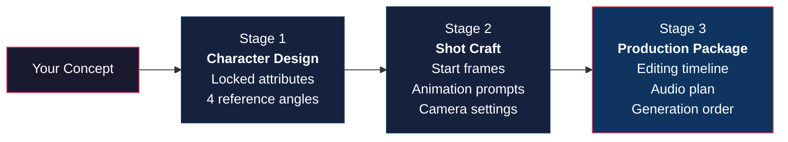

<p align="center">
  
  
  
  
</p>

# AI Film Production Pipeline

### Turn Claude into an AI film director.

A complete filmmaking skill suite for [Claude Code](https://claude.ai/download) that generates structured, production-ready prompts for AI video tools — Veo, Runway, Kling, Sora, Pika, and more.

**Built on real cinematography. Not prompt tricks.**

> Say *"Make me a short film about an astronaut discovering a flower on Mars"* and Claude runs the full production pipeline — character sheets, shot prompts, camera settings, editing timeline.

---

## How It Works



Each stage gates on your approval before advancing. The orchestrator (`ai-film-production`) coordinates all three sub-skills automatically.

---

## Installation

### As a Claude Code Plugin (Recommended)

```bash
claude plugin add https://github.com/Adityaraj0421/ai-cinematic-video-director-claude-skill.git
```

### Manual Installation

```bash
git clone https://github.com/Adityaraj0421/ai-cinematic-video-director-claude-skill.git ~/.claude/skills/ai-film-skills
```

All skills auto-register on next Claude Code session — no configuration needed.

---

## Try It Now

Once installed, just say one of these:

| Prompt | What happens |
|--------|-------------|
| *"Make me a short film about a detective in Tokyo"* | Full pipeline — characters, shots, timeline |
| *"Create a character sheet for a cyberpunk hacker"* | Locked attributes + 4-angle reference prompts |
| *"Generate a cinematic video prompt for a car chase"* | Structured shot with start frame + animation + camera |
| *"Turn this script into AI video prompts"* | Scene breakdown, shot list, editing timeline |

---

## The 4 Skills

| # | Skill | What It Does | Triggers |
|:-:|-------|-------------|----------|
| 1 | **ai-character-sheet-generator** | Locks every visual attribute (face, hair, build, clothing) and generates 4 reference angle prompts | *"create a character sheet"*, *"design a consistent character"* |
| 2 | **ai-cinematic-video-director** | Enforces 5 filmmaking rules and structures every prompt with 6 elements: WHO / WHERE / ACTION / CAMERA / MOOD / PACING | *"generate a video prompt"*, *"create a cinematic shot"* |
| 3 | **ai-storyboard-to-video** | Converts scripts into numbered shot lists with start frames, animation prompts, camera settings, and editing timelines | *"convert storyboard to video"*, *"plan a video sequence"* |
| 4 | **ai-film-production** | Orchestrator — runs all 3 stages in order with approval gates between each | *"make me a film"*, *"produce an AI video"* |

---

## The 5 Core Rules

These are enforced across every skill, every shot, every prompt:

```
 1. START FRAME FIRST     Generate an image before animating. Never text-to-video blind.
 2. PRODUCTION QUALITY    Specify lighting, lens, texture, composition. Bad image = bad video.
 3. STRUCTURED PROMPTS    WHO + WHERE + ACTION + CAMERA + MOOD + PACING. Always.
 4. CHARACTER CONSISTENCY Lock attributes. Paste verbatim. Never paraphrase.
 5. ONE ACTION PER SCENE  One clip, one action. Build complexity in the edit, not the prompt.
```

---

## What You Get

Every production package includes:

```
 Character Sheets      Locked attributes + 4 reference angle prompts per character
 Shot Prompts          Start frame + animation prompt + camera settings per shot
 Editing Timeline      Shot order, duration, transitions, speed ramps
 Audio Plan            Music, ambience, SFX layers with entry/exit points
 Production Notes      Generation order, consistency checklist, tool recommendations
```

---

## Architecture

```
.claude-plugin/
└── plugin.json                          Plugin manifest

skills/
├── ai-film-production/                  Orchestrator (794 words)
│   ├── SKILL.md                         Pipeline stages, smart routing, gates
│   └── references/
│       └── pipeline-example.md          Full worked example: "The Last Commute"
│
├── ai-character-sheet-generator/        Stage 1 (848 words)
│   ├── SKILL.md                         Identity, attributes, 4-angle prompts
│   └── references/
│       └── advanced-character-design.md Expressions, wardrobe variants, ensembles
│
├── ai-cinematic-video-director/         Stage 2 (919 words)
│   ├── SKILL.md                         5 rules, 6-element prompt structure
│   └── references/
│       └── advanced-techniques.md       LLM expansion, motion control, lens tables
│
└── ai-storyboard-to-video/              Stage 3 (959 words)
    ├── SKILL.md                         4-stage conversion pipeline
    └── references/
        └── production-templates.md      Genre templates, blocking, audio planning
```

**Progressive disclosure:** Each SKILL.md is under 1,000 words for fast context loading. Advanced content lives in `references/` and loads only when needed.

---

## Recommended AI Video Tools

| Stage | Tools |
|-------|-------|
| **Image generation** (start frames) | Midjourney, FLUX Pro, Stable Diffusion XL |
| **Video animation** | Veo, Runway Gen-3, Kling 1.5, Minimax, Sora, Pika |
| **Editing & assembly** | DaVinci Resolve, Premiere Pro, CapCut |
| **Audio & music** | Suno, ElevenLabs, Freesound |

---

## Contributing

PRs welcome. If you add a new skill:

1. Follow the progressive disclosure pattern — lean SKILL.md + references/
2. Use imperative/infinitive form (not second person)
3. Include specific trigger phrases in the frontmatter description
4. Keep SKILL.md under 1,500 words

---

## License

[MIT](LICENSE) - Aditya Raj
